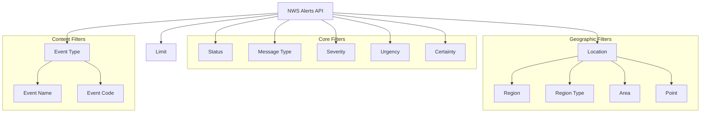
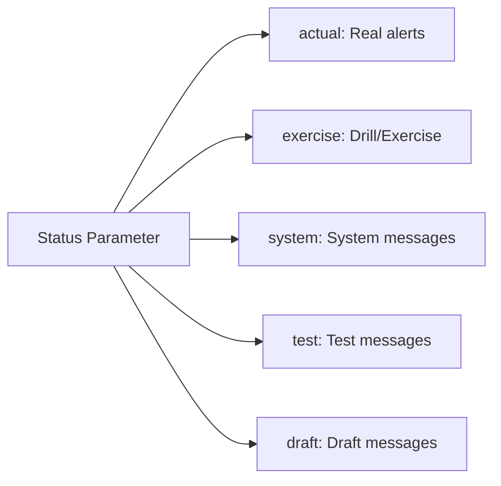
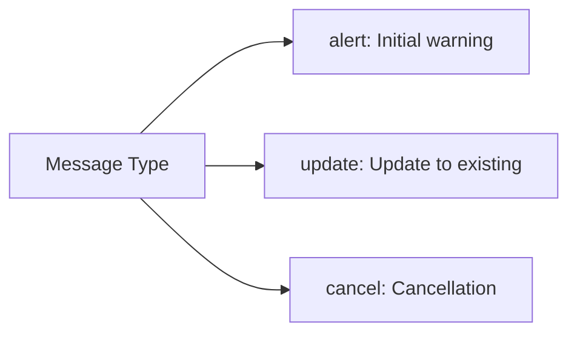
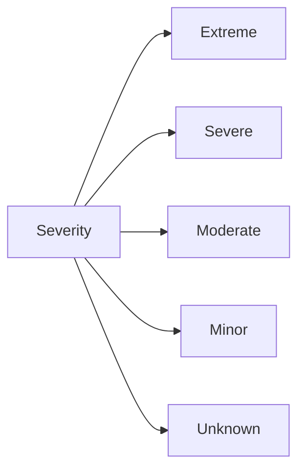
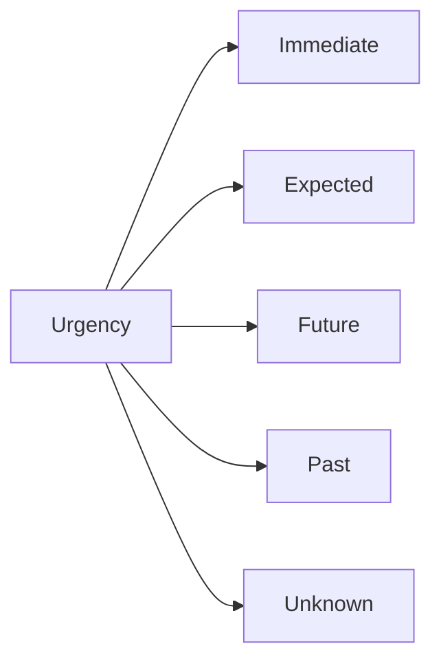
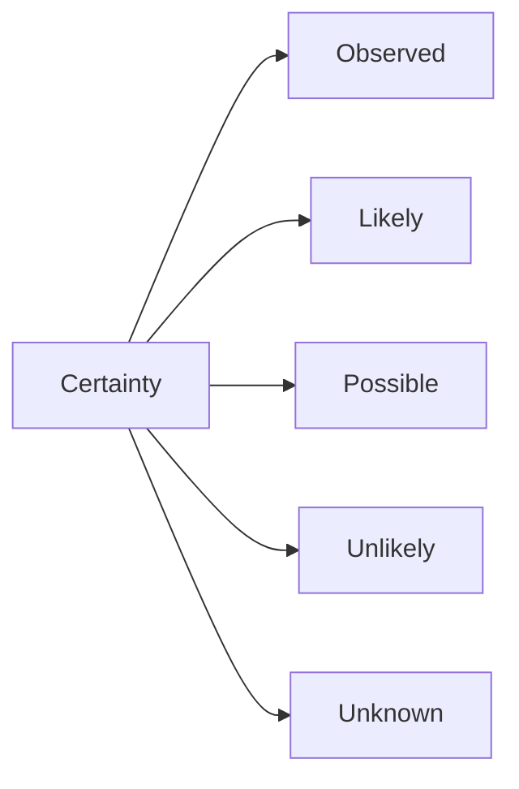

# NWS Alerts API Hierarchy & Flow

This document outlines the hierarchy and flow of the National Weather Service (NWS) Alerts API based on the available parameters. It details how alerts can be filtered and accessed.

## 1. High-Level Hierarchy

The NWS Alerts API allows filtering alerts through several primary parameter categories.

## 2. Detailed Parameter Flow

### 2.1 Status Parameter
Filters alerts based on their lifecycle status.

**Values:**
- **actual**: Usable alerts for real-world hazards.
- **exercise**: Simulated alerts for exercises.
- **system**: Internal system status messages.
- **test**: Test alerts (e.g., weekly tests).
- **draft**: Draft alerts (not typically for public consumption).

---

### 2.2 Message Type Parameter
Filters based on the nature of the update.

**Values:**
- **alert**: The initial issuance of a hazard.
- **update**: Updates to an existing alert (e.g., changing area or time).
- **cancel**: Premature cancellation of an alert.

---

### 2.3 Severity Parameter
Filters based on the severity of the hazard.

**Values:**
- **Extreme**: Extraordinary threat to life or property (e.g., Tornado Emergency).
- **Severe**: Significant threat to life or property (e.g., Severe Thunderstorm Warning).
- **Moderate**: Possible threat (e.g., Winter Weather Advisory).
- **Minor**: Minimal or no known threat.
- **Unknown**: Severity not specified.

---

### 2.4 Urgency Parameter
Filters based on how immediately action is required.

**Values:**
- **Immediate**: Responsive action should be taken immediately.
- **Expected**: Responsive action should be taken soon (within next hour).
- **Future**: Responsive action should be taken in the near future.
- **Past**: Responsive action is no longer required.

---

### 2.5 Certainty Parameter
Filters based on the likelihood of the event.

**Values:**
- **Observed**: Determined to have occurred or to be ongoing.
- **Likely**: Probability > ~50%.
- **Possible**: Probability < ~50%.
- **Unlikely**: Not expected to occur.

---

### 2.6 Location Parameters
Several ways to filter by geography.

- **Region**: Marine/Ocean regions (e.g., `AL` for Alaska Waters, `GM` for Gulf of Mexico).
- **Region Type**: `land` or `marine`.
- **Area**: State or territory codes (e.g., `TX`, `CA`, `NY`).
- **Point**: Specific latitude/longitude (e.g., `39.7456,-97.0892`).

---

### 2.7 Event & Code Parameters
Filter by specific types of weather events.

- **Event**: Full text name (e.g., `Tornado Warning`, `Flood Watch`).
- **Code**: VTEC/SAME codes (e.g., `TOR`, `SVR`, `FFW`).

---

### 2.8 Limit Parameter
Controls the number of results returned.
- Examples: `10`, `50`, `100`.

## 3. Usage Examples

| Goal | URL Structure |
|------|---------------|
| **Active Tornado Warnings** | `?event=Tornado%20Warning&status=actual` |
| **Severe Weather in Texas** | `?area=TX&severity=Severe` |
| **Marine Alerts in Gulf** | `?region=GM&severity=Severe` |
| **Urgent Alerts in LA** | `?point=34.0522,-118.2437&urgency=Immediate` |
