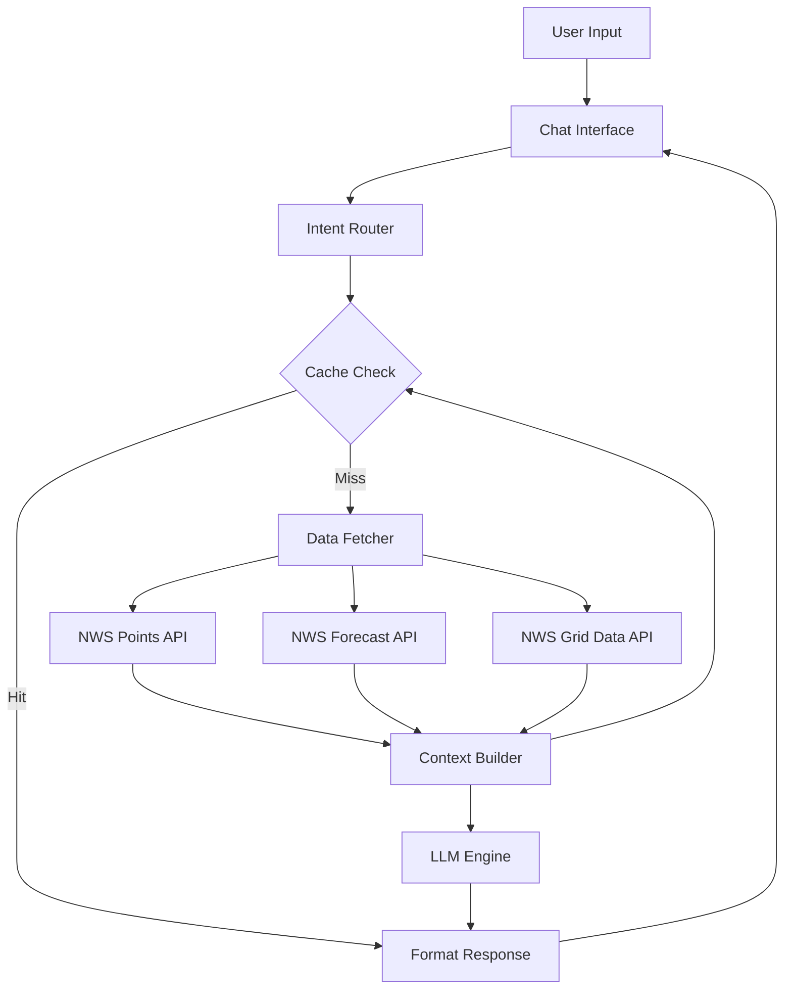

# Weather Chatbot Architecture

## Overview
This document outlines the architecture for a conversational AI chatbot that answers weather-related questions using data from the National Weather Service (NWS) API and LLM intelligence.

## System Architecture



## Core Components

### 1. Chat Interface Layer
**Technology Options:**
- **Option A (Recommended)**: Dash + `dash-chat-components` or custom HTML/CSS chat UI
- **Option B**: Gradio (simpler, faster prototyping)
- **Option C**: Streamlit Chat (easiest but less customizable)

**Features:**
- Message history display
- User input field
- Typing indicators
- Location input (lat/lon or city name)
- Theme-aware styling (light/dark mode)

### 2. Intent Router & Query Processor
**Purpose**: Classify user intent and extract parameters

**Implementation:**
```python
class IntentRouter:
    INTENTS = {
        'current_weather': ['current', 'now', 'today'],
        'forecast': ['tomorrow', 'next', 'week', 'forecast'],
        'specific_metric': ['temperature', 'wind', 'rain', 'humidity'],
        'hazards': ['warning', 'alert', 'hazard', 'danger'],
        'comparison': ['compare', 'difference', 'vs'],
        'general': []  # fallback
    }
    
    def classify(self, query: str) -> dict:
        # Returns: {'intent': str, 'params': dict}
        pass
```

### 3. Data Fetcher & Cache
**Caching Strategy:**
- **TTL**: 30 minutes for forecast data, 15 minutes for grid data
- **Storage**: Redis (production) or in-memory dict (development)
- **Key Format**: `{lat}:{lon}:{endpoint}:{timestamp}`

**Implementation:**
```python
class WeatherDataFetcher:
    def __init__(self):
        self.cache = {}  # or Redis client
        
    def get_weather_data(self, lat: float, lon: float) -> dict:
        cache_key = f"{lat}:{lon}"
        
        # Check cache
        if cache_key in self.cache:
            data, timestamp = self.cache[cache_key]
            if time.time() - timestamp < 1800:  # 30 min
                return data
        
        # Fetch from NWS APIs
        data = {
            'points': self._fetch_points(lat, lon),
            'forecast': self._fetch_forecast(lat, lon),
            'hourly': self._fetch_hourly(lat, lon),
            'grid': self._fetch_grid_data(lat, lon)
        }
        
        self.cache[cache_key] = (data, time.time())
        return data
```

### 4. Context Builder
**Purpose**: Transform raw API data into LLM-friendly context

**Strategy:**
- Extract only relevant data based on intent
- Format as structured text or JSON
- Include metadata (location, time, units)

**Example Context:**
```
Location: Kansas City, MO (39.0997, -94.5786)
Current Time: 2025-11-28 15:00 UTC

CURRENT CONDITIONS (Grid Data):
- Temperature: 42°F
- Humidity: 65%
- Wind: 10 mph from NW
- Sky Cover: 30% (partly cloudy)

FORECAST (Next 24 Hours):
- Tonight: Low 32°F, 20% chance of rain
- Tomorrow: High 45°F, partly cloudy

HAZARDS:
- None active
```

### 5. LLM Engine
**Recommended Options:**

#### **Option A: OpenAI GPT-4 (Best Quality)**
```python
from openai import OpenAI

class OpenAIEngine:
    def __init__(self, api_key: str):
        self.client = OpenAI(api_key=api_key)
        
    def generate_response(self, query: str, context: str) -> str:
        response = self.client.chat.completions.create(
            model="gpt-4-turbo-preview",
            messages=[
                {"role": "system", "content": SYSTEM_PROMPT},
                {"role": "user", "content": f"Context:\n{context}\n\nQuestion: {query}"}
            ],
            temperature=0.7,
            max_tokens=500
        )
        return response.choices[0].message.content
```

**Cost**: ~$0.01 per request

#### **Option B: Anthropic Claude (Best for Complex Reasoning)**
```python
from anthropic import Anthropic

class ClaudeEngine:
    def __init__(self, api_key: str):
        self.client = Anthropic(api_key=api_key)
        
    def generate_response(self, query: str, context: str) -> str:
        message = self.client.messages.create(
            model="claude-3-5-sonnet-20241022",
            max_tokens=500,
            system=SYSTEM_PROMPT,
            messages=[
                {"role": "user", "content": f"Context:\n{context}\n\nQuestion: {query}"}
            ]
        )
        return message.content[0].text
```

**Cost**: ~$0.015 per request

#### **Option C: Local LLM (Free, Private)**
```python
from transformers import AutoModelForCausalLM, AutoTokenizer

class LocalLLMEngine:
    def __init__(self, model_name="microsoft/Phi-3-mini-4k-instruct"):
        self.tokenizer = AutoTokenizer.from_pretrained(model_name)
        self.model = AutoModelForCausalLM.from_pretrained(model_name)
        
    def generate_response(self, query: str, context: str) -> str:
        prompt = f"{SYSTEM_PROMPT}\n\nContext:\n{context}\n\nQuestion: {query}\nAnswer:"
        inputs = self.tokenizer(prompt, return_tensors="pt")
        outputs = self.model.generate(**inputs, max_length=512)
        return self.tokenizer.decode(outputs[0], skip_special_tokens=True)
```

**Cost**: Free (requires GPU for good performance)

#### **Option D: Google Gemini (Best Value)**
```python
import google.generativeai as genai

class GeminiEngine:
    def __init__(self, api_key: str):
        genai.configure(api_key=api_key)
        self.model = genai.GenerativeModel('gemini-1.5-flash')
        
    def generate_response(self, query: str, context: str) -> str:
        prompt = f"{SYSTEM_PROMPT}\n\nContext:\n{context}\n\nQuestion: {query}"
        response = self.model.generate_content(prompt)
        return response.text
```

**Cost**: ~$0.0001 per request (cheapest)

### 6. System Prompt Design
```python
SYSTEM_PROMPT = """You are a helpful weather assistant with access to real-time weather data from the National Weather Service.

GUIDELINES:
1. Answer questions accurately based on the provided context
2. Use natural, conversational language
3. Include specific numbers and units when relevant
4. If asked about future weather beyond the forecast period, clearly state the limitation
5. For hazard questions, be clear and emphasize safety
6. If the context doesn't contain the answer, say so honestly
7. Keep responses concise (2-3 sentences unless more detail is requested)

RESPONSE FORMAT:
- Start with a direct answer
- Provide supporting details
- Add context or recommendations if helpful
"""
```

## Implementation Approaches

### **Approach 1: Integrated Dash App (Recommended)**
**Pros:**
- Single application
- Shared theme and styling
- Access to existing data fetching logic
- Better user experience

**Cons:**
- More complex implementation
- Requires custom chat UI component

**File Structure:**
```
NextWeather/
├── dashboard.py          # Main dashboard
├── chatbot.py           # Chatbot logic
├── components/
│   ├── chat_ui.py       # Chat interface component
│   └── message.py       # Message bubble component
├── services/
│   ├── data_fetcher.py  # Weather data fetching
│   ├── llm_engine.py    # LLM integration
│   └── context_builder.py
└── config.py            # API keys, settings
```

### **Approach 2: Separate Gradio App**
**Pros:**
- Fastest to implement
- Built-in chat UI
- Easy deployment

**Cons:**
- Separate application
- Different styling
- Duplicate data fetching logic

**Implementation:**
```python
import gradio as gr

def chat_response(message, history, location):
    # Fetch weather data
    data = fetch_weather_data(location)
    
    # Build context
    context = build_context(data, message)
    
    # Get LLM response
    response = llm_engine.generate(message, context)
    
    return response

demo = gr.ChatInterface(
    fn=chat_response,
    additional_inputs=[
        gr.Textbox(label="Location (lat,lon)", value="39.0997,-94.5786")
    ],
    title="Weather Chatbot",
    description="Ask me anything about the weather!"
)

demo.launch()
```

### **Approach 3: API + Frontend Split**
**Pros:**
- Clean separation of concerns
- Can support multiple frontends
- Easier to scale

**Cons:**
- More infrastructure
- Requires API deployment

**Architecture:**
```
Backend (FastAPI):
- /api/chat (POST) - Main chat endpoint
- /api/weather/{lat}/{lon} - Weather data endpoint

Frontend (Dash):
- Chat interface
- Calls backend API
```

## Recommended Solution

### **Best Approach: Integrated Dash App with Gemini**

**Why:**
1. **Cost-effective**: Gemini Flash is 100x cheaper than GPT-4
2. **Fast**: Sub-second response times
3. **Quality**: Good enough for weather Q&A
4. **Integrated**: Single app, better UX
5. **Scalable**: Can upgrade to Claude/GPT-4 later

### Implementation Steps

#### **Step 1: Install Dependencies**
```bash
pip install google-generativeai dash-chat-components redis
```

#### **Step 2: Create Chat Component**
```python
# components/chat_ui.py
from dash import html, dcc, Input, Output, State, callback
import dash_chat_components as dcc_chat

def create_chat_layout():
    return html.Div([
        html.H3("Weather Assistant", style={'textAlign': 'center'}),
        
        # Location input
        html.Div([
            dcc.Input(
                id='chat-location',
                type='text',
                placeholder='Enter lat,lon (e.g., 39.0997,-94.5786)',
                style={'width': '100%', 'marginBottom': '10px'}
            )
        ]),
        
        # Chat messages container
        html.Div(
            id='chat-messages',
            style={
                'height': '400px',
                'overflowY': 'auto',
                'border': '1px solid #ddd',
                'borderRadius': '8px',
                'padding': '10px',
                'marginBottom': '10px'
            }
        ),
        
        # Input area
        html.Div([
            dcc.Input(
                id='chat-input',
                type='text',
                placeholder='Ask about the weather...',
                style={'width': '85%', 'marginRight': '10px'}
            ),
            html.Button('Send', id='chat-send-btn', n_clicks=0)
        ], style={'display': 'flex'}),
        
        # Store for message history
        dcc.Store(id='chat-history', data=[])
    ])
```

#### **Step 3: Implement Chatbot Service**
```python
# services/chatbot_service.py
import google.generativeai as genai
from typing import List, Dict
import json

class WeatherChatbot:
    def __init__(self, api_key: str, data_fetcher):
        genai.configure(api_key=api_key)
        self.model = genai.GenerativeModel('gemini-1.5-flash')
        self.data_fetcher = data_fetcher
        
    def process_query(self, query: str, lat: float, lon: float, 
                     history: List[Dict] = None) -> str:
        # Fetch weather data
        weather_data = self.data_fetcher.get_weather_data(lat, lon)
        
        # Build context
        context = self._build_context(weather_data, query)
        
        # Build conversation history
        messages = self._format_history(history) if history else ""
        
        # Generate response
        prompt = f"""{SYSTEM_PROMPT}

{messages}

Current Weather Context:
{context}

User Question: {query}

Assistant Response:"""
        
        response = self.model.generate_content(prompt)
        return response.text
    
    def _build_context(self, data: dict, query: str) -> str:
        # Intelligent context selection based on query
        context_parts = []
        
        query_lower = query.lower()
        
        # Always include current conditions
        if 'properties' in data.get('grid', {}):
            context_parts.append(self._format_current_conditions(data['grid']))
        
        # Include forecast if asking about future
        if any(word in query_lower for word in ['tomorrow', 'next', 'forecast', 'will']):
            context_parts.append(self._format_forecast(data['hourly']))
        
        # Include hazards if asking about safety/warnings
        if any(word in query_lower for word in ['safe', 'warning', 'alert', 'hazard']):
            context_parts.append(self._format_hazards(data['grid']))
        
        return "\n\n".join(context_parts)
    
    def _format_current_conditions(self, grid_data: dict) -> str:
        # Extract current values (reuse get_current_grid_value logic)
        return "CURRENT CONDITIONS:\n- Temperature: 42°F\n- Wind: 10 mph\n..."
    
    def _format_forecast(self, hourly_data: dict) -> str:
        periods = hourly_data['properties']['periods'][:24]
        return f"24-HOUR FORECAST:\n{json.dumps(periods, indent=2)}"
    
    def _format_hazards(self, grid_data: dict) -> str:
        hazards = grid_data['properties'].get('hazards', {}).get('values', [])
        if not hazards:
            return "HAZARDS: None active"
        return f"ACTIVE HAZARDS:\n{json.dumps(hazards, indent=2)}"
    
    def _format_history(self, history: List[Dict]) -> str:
        formatted = []
        for msg in history[-5:]:  # Last 5 messages for context
            role = "User" if msg['role'] == 'user' else "Assistant"
            formatted.append(f"{role}: {msg['content']}")
        return "\n".join(formatted)
```

#### **Step 4: Add to Main Dashboard**
```python
# In dashboard.py, add new tab:

dcc.Tab(id='tab-chat', label='Weather Assistant', children=[
    html.Div([
        create_chat_layout()
    ], style={'padding': '20px', 'maxWidth': '800px', 'margin': '0 auto'}),
]),
```

#### **Step 5: Implement Callback**
```python
@callback(
    Output('chat-messages', 'children'),
    Output('chat-history', 'data'),
    Output('chat-input', 'value'),
    Input('chat-send-btn', 'n_clicks'),
    State('chat-input', 'value'),
    State('chat-location', 'value'),
    State('chat-history', 'data'),
    prevent_initial_call=True
)
def handle_chat(n_clicks, message, location, history):
    if not message or not location:
        return [], history, message
    
    # Parse location
    try:
        lat, lon = map(float, location.split(','))
    except:
        return [html.Div("Invalid location format", style={'color': 'red'})], history, message
    
    # Add user message to history
    history.append({'role': 'user', 'content': message})
    
    # Get bot response
    response = chatbot.process_query(message, lat, lon, history)
    
    # Add bot response to history
    history.append({'role': 'assistant', 'content': response})
    
    # Render messages
    messages = []
    for msg in history:
        is_user = msg['role'] == 'user'
        messages.append(
            html.Div([
                html.Div(msg['content'], style={
                    'backgroundColor': '#007bff' if is_user else '#f1f1f1',
                    'color': 'white' if is_user else 'black',
                    'padding': '10px',
                    'borderRadius': '10px',
                    'marginBottom': '10px',
                    'maxWidth': '70%',
                    'marginLeft': 'auto' if is_user else '0',
                    'marginRight': '0' if is_user else 'auto'
                })
            ])
        )
    
    return messages, history, ""  # Clear input
```

## Advanced Features

### 1. Multi-turn Conversations
- Maintain conversation context
- Reference previous questions
- Follow-up questions

### 2. Location Intelligence
- Geocoding (city name → lat/lon)
- Multiple location tracking
- Location-based suggestions

### 3. Proactive Alerts
- Push notifications for hazards
- Daily weather summaries
- Severe weather warnings

### 4. Voice Interface
- Speech-to-text input
- Text-to-speech responses
- Hands-free operation

### 5. Visualization Integration
- Generate graphs on demand
- "Show me temperature trend" → display graph
- Interactive data exploration

## Cost Analysis

### Per 1000 Requests:

| LLM Provider | Cost | Response Time | Quality |
|-------------|------|---------------|---------|
| Gemini Flash | $0.10 | 0.5s | Good |
| GPT-3.5 Turbo | $2.00 | 1.0s | Very Good |
| GPT-4 Turbo | $10.00 | 2.0s | Excellent |
| Claude Sonnet | $15.00 | 1.5s | Excellent |
| Local (Phi-3) | $0.00 | 3.0s | Good |

**Recommendation**: Start with Gemini Flash, upgrade to GPT-4/Claude for production if needed.

## Deployment Considerations

### Development
```bash
python dashboard.py
# Access at http://localhost:8050
```

### Production
**Option 1: Heroku**
```bash
heroku create nextweather-chat
git push heroku main
```

**Option 2: Railway**
- Connect GitHub repo
- Auto-deploy on push
- Free tier available

**Option 3: Docker + Cloud Run**
```dockerfile
FROM python:3.11-slim
WORKDIR /app
COPY requirements.txt .
RUN pip install -r requirements.txt
COPY . .
CMD ["gunicorn", "-b", "0.0.0.0:8080", "dashboard:server"]
```

## Security & Privacy

### API Key Management
```python
# config.py
import os
from dotenv import load_dotenv

load_dotenv()

GEMINI_API_KEY = os.getenv('GEMINI_API_KEY')
NWS_USER_AGENT = os.getenv('NWS_USER_AGENT', 'nextweather-chat')
```

### Rate Limiting
```python
from functools import lru_cache
import time

class RateLimiter:
    def __init__(self, max_requests=10, window=60):
        self.max_requests = max_requests
        self.window = window
        self.requests = {}
    
    def allow_request(self, user_id: str) -> bool:
        now = time.time()
        if user_id not in self.requests:
            self.requests[user_id] = []
        
        # Remove old requests
        self.requests[user_id] = [
            req for req in self.requests[user_id] 
            if now - req < self.window
        ]
        
        if len(self.requests[user_id]) < self.max_requests:
            self.requests[user_id].append(now)
            return True
        return False
```

## Next Steps

1. **Phase 1**: Implement basic chat interface in Dash
2. **Phase 2**: Integrate Gemini API
3. **Phase 3**: Add context building logic
4. **Phase 4**: Implement caching
5. **Phase 5**: Add advanced features (voice, alerts)
6. **Phase 6**: Deploy to production

## Conclusion

The recommended architecture provides a scalable, cost-effective solution for a weather chatbot using:
- **Dash** for the integrated UI
- **Gemini Flash** for LLM intelligence
- **NWS APIs** for real-time weather data
- **Redis** for caching (optional)

This approach balances cost, performance, and user experience while maintaining flexibility for future enhancements.
