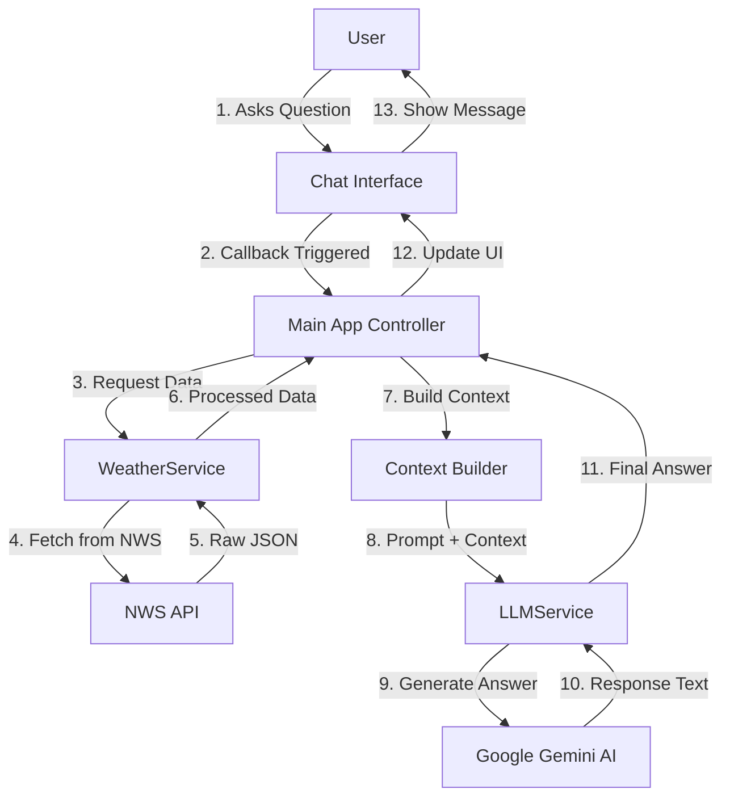

# Weather Chatbot Architecture & Data Flow

This document explains the internal architecture of the Weather Chatbot and traces the journey of a user's question through the system.

## 🏗️ System Architecture

The chatbot is built using a **Service-Oriented Architecture** with three main layers:

1.  **Presentation Layer (UI)**: Built with Dash (`components/chat_ui.py`)
2.  **Application Layer (Controller)**: Main logic in `app.py`
3.  **Service Layer (Backend)**:
    *   `WeatherService`: Handles NWS API interactions
    *   `LLMService`: Handles Google Gemini AI interactions



---

## 🔄 Detailed Data Flow: "How is the weather?"

Let's trace what happens when a user asks: **"What is the temperature right now?"**

### Phase 1: User Input & Initialization
1.  **User Action**: Types "What is the temperature right now?" and clicks Send.
2.  **Dash Callback**: The `handle_chat` function in `app.py` is triggered.
3.  **State Retrieval**: The app retrieves the current location (e.g., "39.0997,-94.5786") from the input field.

### Phase 2: Data Retrieval (`WeatherService`)
The app calls `weather_service.get_weather_data(lat, lon)`.

1.  **API Call**: The service sends a request to `https://api.weather.gov/points/39.0997,-94.5786`.
2.  **Endpoint Discovery**: NWS returns links to the `forecast`, `hourly`, and `gridData` endpoints.
3.  **Parallel Fetching**: The service fetches data from all three endpoints:
    *   **Forecast**: Daily high/low, summaries.
    *   **Hourly**: Hour-by-hour temperature, wind, etc.
    *   **Grid Data**: Raw sensor data (Temperature, Dewpoint, etc.).

### Phase 3: Context Building (The "Brain")
The app doesn't send *all* the raw data to the AI (it's too large). Instead, it extracts the most important parts:

1.  **Current Conditions**:
    *   Extracts the temperature value for the *current hour* from Grid Data.
    *   *Result*: "Temperature: 42°F, Wind: 10 mph"
2.  **Forecast Summary**:
    *   Takes the next 3 periods from the Forecast API.
    *   *Result*: "Tonight: Mostly cloudy, low around 30."
3.  **Hazards**:
    *   Checks for active alerts.
    *   *Result*: "No active hazards."

**Final Context Block**:
```text
CURRENT CONDITIONS:
- Temperature: 42.0 °F
- Humidity: 65%
- Wind Speed: 10 mph

FORECAST SUMMARY:
- This Afternoon: Mostly sunny, with a high near 45.
- Tonight: Mostly cloudy, with a low around 32.

ACTIVE HAZARDS: None
```

### Phase 4: AI Processing (`LLMService`)
The app calls `llm_service.generate_response(query, context)`.

1.  **Prompt Engineering**: We combine the System Prompt, Context, and User Question into one package for Gemini.

    **The Full Prompt sent to Gemini:**
    ```text
    You are a helpful weather assistant... [System Prompt]

    DATA CONTEXT:
    CURRENT CONDITIONS:
    - Temperature: 42.0 °F
    ... [The context we built above]

    USER QUESTION:
    What is the temperature right now?

    ASSISTANT RESPONSE:
    ```

2.  **Generation**: Google Gemini (Model: `gemini-2.0-flash`) analyzes the prompt.
    *   It sees the user wants "temperature".
    *   It looks at the "DATA CONTEXT".
    *   It finds "- Temperature: 42.0 °F".
    *   It formulates a natural sentence.

3.  **Output**: Gemini returns: *"The current temperature is 42°F."*

### Phase 5: Response Delivery
1.  **Return to App**: `LLMService` returns the text string.
2.  **Update History**: `app.py` appends the user message and AI response to the chat history list.
3.  **Render UI**: Dash updates the `chat-messages` component to show the new message bubbles.

---

## 🧩 Key Components Explained

### 1. `WeatherService` (`services/weather_service.py`)
*   **Role**: The "Data Fetcher".
*   **Magic**: It handles the complexity of NWS's 3-step API process (Points -> Forecast/Grid).
*   **Smart Parsing**: It knows how to read NWS's ISO 8601 time formats (e.g., `2025-11-28T14:00:00+00:00/PT1H`) to find the exact value for *now*.

### 2. `LLMService` (`services/llm_service.py`)
*   **Role**: The "Intelligence".
*   **Model**: Uses `gemini-2.0-flash` for sub-second responses.
*   **System Prompt**: Instructions that tell the AI how to behave (e.g., "Use Fahrenheit", "Be concise").

### 3. `app.py` (The Controller)
*   **Role**: The "Conductor".
*   **Orchestration**: It coordinates the flow: UI -> Weather Service -> LLM Service -> UI.
*   **State Management**: It keeps track of the conversation history in the user's browser session.

## 🚀 Why this Architecture?
*   **Cost Efficient**: We only send relevant text to the LLM, not megabytes of raw JSON.
*   **Accurate**: The LLM doesn't "hallucinate" the weather; it *reads* the real data we provide.
*   **Scalable**: We can easily swap the LLM (e.g., to GPT-4) or the Weather Provider without rewriting the whole app.

---

## 🧠 Supported Questions & Intents

The chatbot is designed to handle various **Intents**—the underlying goals behind a user's question. While the LLM handles the natural language understanding, the system provides specific data to support these intents.

### 1. Current Conditions Intent
*   **Goal**: User wants to know what's happening *right now*.
*   **Backend Support**: `WeatherService` parses the `gridData` endpoint to find values matching the current UTC timestamp.
*   **Example Questions**:
    *   "What is the temperature?"
    *   "Is it windy right now?"
    *   "What's the humidity?"
    *   "Is it raining?"

### 2. Forecast Intent
*   **Goal**: User wants to know about the *future* (later today, tomorrow, or the week ahead).
*   **Backend Support**: `WeatherService` retrieves the text summary from the `forecast` endpoint (e.g., "Tonight", "Tomorrow").
*   **Example Questions**:
    *   "What's the weather like tomorrow?"
    *   "Will it rain this weekend?"
    *   "Do I need an umbrella for tonight?"
    *   "What is the high for Tuesday?"

### 3. Hazard/Alert Intent
*   **Goal**: User is concerned about safety or severe weather.
*   **Backend Support**: `WeatherService` checks the `hazards` property in `gridData` for active watches, warnings, or advisories.
*   **Example Questions**:
    *   "Are there any weather alerts?"
    *   "Is there a storm warning?"
    *   "Is it safe to drive?"
    *   "Any active hazards?"

### 4. Clothing/Activity Recommendation Intent
*   **Goal**: User wants practical advice based on the weather.
*   **Backend Support**: The LLM combines temperature, precipitation, and wind data to generate logical advice.
*   **Example Questions**:
    *   "Should I wear a jacket?"
    *   "Can I go for a run?"
    *   "Is it good weather for a picnic?"
    *   "Do I need sunglasses?"

### 5. Astronomical/Time Intent
*   **Goal**: User asks about day/night cycles (though currently limited by available data).
*   **Backend Support**: The LLM infers this from the forecast text (e.g., "Sunny" implies day, "Clear" implies night) or general knowledge.
*   **Example Questions**:
    *   "Is it going to be a clear night?"
    *   "Will it be sunny all day?"

---

## ⚙️ Backend Intent Processing (Deep Dive)

Although we use a Generative AI (Gemini) which handles intents fluidly, we structure our **Data Context** to ensure every intent has the necessary raw material.

### How the Backend Prepares for ANY Intent:

The `WeatherService` acts as a **Pre-emptive Data Aggregator**. It doesn't wait to know the intent; it assumes the user *might* ask about anything.

1.  **The "Now" Snapshot**:
    *   *Why*: For "Current Conditions" intents.
    *   *Action*: We iterate through time-series data to find the exact value for `datetime.now()`.
    *   *Data Points*: Temp, Dewpoint, Humidity, Wind Speed, Wind Direction, Sky Cover.

2.  **The "Future" Narrative**:
    *   *Why*: For "Forecast" intents.
    *   *Action*: We grab the first 3 periods of the NWS text forecast (e.g., "This Afternoon", "Tonight", "Tomorrow").
    *   *Logic*: 90% of user questions are about the immediate future (next 24 hours).

3.  **The "Safety" Check**:
    *   *Why*: For "Hazard" intents.
    *   *Action*: We scan the `hazards` list. If empty, we explicitly state "No active hazards" to prevent the LLM from hallucinating a warning.

### The LLM's Role in Intent Resolution:

Once the `LLMService` receives the user's question and this pre-packaged context, it performs **Dynamic Intent Resolution**:

*   **If User asks**: *"Can I wear shorts?"*
    *   **LLM Logic**:
        1.  Identify Intent: **Clothing Recommendation**.
        2.  Look for Data: Checks "Current Temperature" (e.g., 45°F).
        3.  Apply Logic: 45°F is too cold for shorts.
        4.  Generate Response: "It's 45°F, so you might be cold in shorts. Pants would be better."

*   **If User asks**: *"Is the storm over?"*
    *   **LLM Logic**:
        1.  Identify Intent: **Hazard/Status**.
        2.  Look for Data: Checks "Active Hazards".
        3.  Apply Logic: If "None", then yes, it's likely over or wasn't severe.
        4.  Generate Response: "There are no active weather hazards reported right now."

